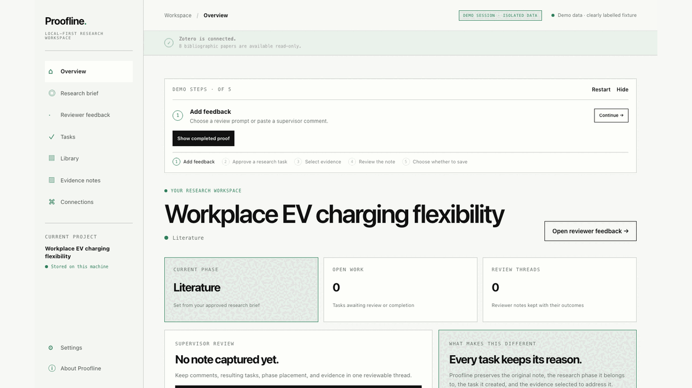

# Proofline

A supervisor says, “Strengthen this claim.” The real work is figuring out which papers support the revision and keeping the evidence trail intact. Proofline turns that comment into an approved research task, searches your own Zotero library, lets you select what counts as evidence, and creates a grounded note preview that cannot cite sources you did not choose.



```bash
npm install
npm run app -- --demo
```

## Working vertical slice

```text
reviewer feedback
  → Codex CLI task graph
  → researcher approves an evidence task
  → read-only Zotero search
  → researcher selects evidence
  → Codex CLI grounded draft
  → researcher previews note
  → Claim Traceback: source note → evidence → task → feedback
  → explicit Obsidian write approval
```

The researcher remains the decision-maker: rejected tasks cannot run, only selected source IDs can enter drafting, and filesystem writes are separate approvals.

After a workflow runs, Proofline can export a **Revision Response Matrix**: a reviewer-readable Markdown table of each comment, proposed task, researcher decision, selected Zotero sources, and grounded-note status. It reports only the approval and evidence trail Proofline can verify; it never claims an unverified manuscript change.

**Claim Traceback** lets the researcher select a grounded source note and inspect its selected Zotero record, approved task, original reviewer feedback, and response-matrix status. It traces only source-backed draft notes—not arbitrary manuscript sentences that Proofline has not verified.

Proofline maintains the legacy-compatible `.thesisos/thesis-state.json` as the canonical record of links between feedback, manuscript citations, selected evidence, model-proposed claims, and researcher approvals. Zotero and the local research checkout remain authoritative for their native data; generated Obsidian views are deterministic and regenerable. See the [canonical workspace commands](docs/cli.md#canonical-revision-workspace).

## Connections stay in their own lane

Proofline connects the research tools around the evidence loop without pretending to replace them:

- **VS Code:** choose an existing folder or create a local code workspace, then open that configured folder in VS Code.
- **Obsidian:** choose an existing vault or scaffold a research vault with `10_Literature_Notes`, resources, implementation, and research-note folders. Notes are previewed before an explicit write approval.
- **Overleaf:** create a project in your own Overleaf account or store its `overleaf.com` URL. Proofline opens that URL in the browser; it does not sign in, sync, or edit Overleaf files.

Each location is optional and saved only for the current project.

## Quick start

For judges and reviewers, start the complete credential-free fixture workflow:

```bash
npm install
npm run app -- --demo
```

Open [http://127.0.0.1:4173](http://127.0.0.1:4173). Demo mode uses a clearly labelled fixture library, falls back safely when Codex is unavailable, and never writes to the filesystem. For the fastest judge walkthrough, choose **Show completed proof**: it replays the same approval-gated fixture transitions and opens Claim Traceback at the completed evidence trail. Choose **Test citation boundary** to watch a draft containing an unselected source ID be refused before preview.

For a real project, choose **Set up my research** and enter a name. Every other step is optional: import a PDF/Markdown/text project description, connect Zotero, choose a VS Code folder, initialize an Obsidian vault, add an Overleaf URL, and record the selected scope or stage. Feedback can be captured immediately; task decomposition remains locked until the minimum brief is approved so generated work always has project context.

For the real local workflow, keep Zotero Desktop running and use:

```bash
npm run app
```

The live path uses the read-only Zotero Desktop API and your authenticated Codex CLI session. Check authentication with `codex login status`.

To show the live loop: create or open a local research workspace, connect Zotero Desktop, add feedback, approve a literature task, search and select your own papers, then prepare a note preview. In **Evidence notes**, choose **Verify citation boundary**. It submits a deliberately invalid local test source ID against your selected evidence; the server rejects it before preview and no Zotero item, note, or file is changed.

Proofline runs on macOS, Windows, and Linux with Node.js 22+. The optional submission-media helpers (`npm run render:video` and `npm run capture:submission`) are macOS development scripts: they use macOS `say`, the default macOS Chrome path, and external `ffmpeg`/ImageMagick tooling.

## Website walkthrough

1. Connect Zotero Desktop, or start with the labelled demo library.
2. Paste the exact supervisor feedback.
3. Review the validated task graph and approve the literature task.
4. Run the approved read-only Zotero search.
5. Select reviewed papers and attach them as structured evidence.
6. Continue to the dedicated Evidence notes step and draft with Codex CLI or the local template.
7. Use Claim Traceback to inspect a source note's evidence, task approval, and feedback trail.
8. Preview the note, then explicitly approve saving it to the configured Obsidian vault.

## How Codex and GPT-5.6 are used

Proofline was built with Codex using GPT-5.6; the verified build and feedback ID is `019f5cc1-08be-7071-a5ea-220a8de0f313` ([feedback receipt](docs/assets/codex-feedback-receipt.png)). At runtime, users can choose Codex CLI, the optional OpenAI adapter, or a labelled deterministic fallback.

Build-time GPT-5.6 usage and runtime model selection are separate. The detailed implementation record and model boundaries are documented in the [submission notes](docs/devpost-submission.md).

## Why you can use it on real research

- **Search boundary:** Proofline reads Zotero metadata but cannot alter the library.
- **Measured retrieval:** the included five-query fixture reports recall@5 of **0.83** and mean reciprocal rank of **1.0**; it is a small regression check, not a general performance claim.
- **Evidence boundary:** drafting receives only reviewed evidence, and drafts containing unselected source IDs are rejected.
- **Write boundary:** notes are previewed before a separate filesystem approval; judge mode cannot write at all.
- **Revision boundary:** response-matrix exports are read-only views of the canonical approval and evidence trail.
- **Final hardening:** Codex session `019f6859-ae92-7280-930a-f7d7bf5b11ea` added revision-safe state writes, judge-route isolation, one-time note previews, safe managed-write paths, and frontend URL/attribute hardening. Its final review recorded 184 passing tests; see the [verification guide](docs/verification.md#final-codex-hardening-record).

## Paper maps and vault maintenance

The core submission stops at the evidence-backed note. Two additional endpoints provide safe building blocks for later workflows:

- `POST /api/papers/card` creates provenance-aware paper cards while leaving unverified research fields marked `needs-review`.
- `POST /api/obsidian/audit` reports broken wiki links and managed notes missing source IDs without changing the vault.

## Documentation

- [CLI reference](docs/cli.md)
- [Zotero setup and library selection](docs/zotero.md)
- [Semantic retrieval and evaluation](docs/retrieval.md)
- [Verification guide](docs/verification.md)
- [Adapter roadmap](docs/roadmap.md)
- [Submission demo script](docs/submission-demo.md)
- [Devpost submission copy](docs/devpost-submission.md)
- [Architecture decisions](docs/decisions/)

## Submission

Verified Codex GPT-5.6 build and `/feedback` ID: `019f5cc1-08be-7071-a5ea-220a8de0f313`

See the [submission copy and checklist](docs/devpost-submission.md) for the demo, category, and remaining manual submission steps.

## Common commands

```bash
npm test
npm run check && npm run check:frontend
npm run demo -- --codex --feedback-file ./my-feedback.txt --output-dir ./demo-output/codex-run
```

See [docs/cli.md](docs/cli.md) for all flags and operational details.

## License

[MIT](LICENSE)
